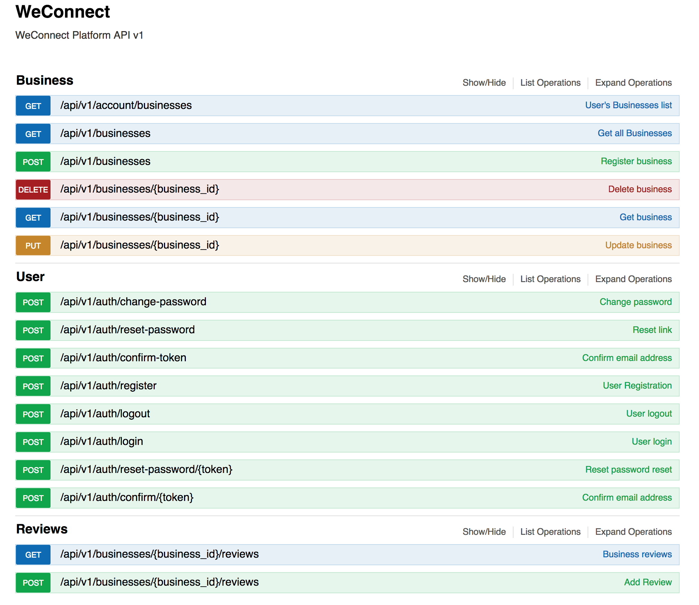

# WeConnect 
[](https://travis-ci.org/muhozi/WeConnect-2)
[](https://coveralls.io/github/muhozi/WeConnect-2)
[](https://codecov.io/gh/muhozi/WeConnect-2)
[](https://www.codacy.com/app/muhozi/WeConnect-2?utm_source=github.com&amp;utm_medium=referral&amp;utm_content=muhozi/WeConnect-2&amp;utm_campaign=Badge_Grade)
[](https://codeclimate.com/github/muhozi/WeConnect-2/maintainability)


WeConnect provides a platform that brings businesses and individuals together. This platform creates awareness for businesses and gives the users the ability to write reviews about the businesses they have interacted with. 

## API




**TL**;**DR** Check the API docs at https://allconnect.herokuapp.com/api/v1 

### Prerequisites

* Python > 3
* PostgreSQL

### Set up the environment

This platform API is built on the top Flask python web framework.

Clone the repository

```sh
git clone git@github.com:muhozi/WeConnect-2.git
```

Create the virtual environment and install dependencies(These are required Python,pip and virtual environment):

```sh
cd WeConnect
```

```sh
virtualenv env
```

Activate the virtual environment [For windows]

```sh
cd env/Scripts && activate && cd ../..
```

Activate the virtual environment [For Unix based system]

```sh
source env/bin/activate
```

Install dependencies using pip

```sh
pip install -r requirements.txt
```

**Creating database**

Create a database with any given name (for ex `weconnect`) and create database(testing database) with the same name with `_test` appended, as our example this would be `weconnect_test`.

**Set required environment variables:**

You may use `.env` configuration file (Loaded using [python-dotenv](https://github.com/theskumar/python-dotenv)):

Create file name it `.env` and add the following contents:

```sh
DEBUG=True
ENV='development'
SECRET_KEY='_custom_secret_key'
DATABASE_URI='postgresql://db_user:db_pass@db_host:db_port/db_name'
MAIL_SERVER='smtp.mailhost.net'
MAIL_PORT=25
MAIL_USERNAME='mail_username'
MAIL_PASSWORD='mail_password'
MAIL_DEFAULT_SENDER='default@mailhost.com'
```

To send emails, make sure that you have SMTP server to use. 

### Run the application

To run the tests, use `nosetests` or any other test runner of your choice

```sh
nosetests -v
```

Then run the app

```sh
python app.py
```


### View API usage (Documentation)

View the API usage (Documentation) in a browser via: http://127.0.0.1:5000/api/v1


### API Endpoints

**`POST /auth/register`** *User registration*

**`POST /auth/login`** *User login*

**`GET /businesses/<business-id>/reviews`** *Get all the reviews about a business*

**`GET /businesses/<business-id>`** *Get a business details*

**`GET /businesses`** *Get all registered businesses*


<u>**Protected endpoints**</u>: Access token is required (`Authorization` header token)

**`POST /auth/logout`** *User logout*

**`POST /auth/reset-password`** *Request password reset*

**`POST /auth/reset-password/<token>`** *Reset password *

**`POST /businesses`** *Register business*

**`PUT /businesses/<business-id>`** *Update business details*

**`DELETE /businesses/<business-id>`** *Delete business*

**`GET /account/businesses`** *Get authenticated user's registered businesses*

**`POST /businesses/<business-id>/reviews`** *Post a review about business*

**`POST /auth/change-password`** Change password

**`POST /auth/confirm-token`** Check if confirm email token exists

**`POST /auth/confirm/<token>`** Confirm email


> The above endpoints may be accessed on Heroku, the base URL is https://allconnect.herokuapp.com
>
> Also you may read and try out the detailed usage of the API through its documentation at 
>
>  https://allconnect.herokuapp.com/api/v1


## User Interface

WeConnect use the following UI technology:

- ReactJS / Redux

Check the front app [here](https://connectship.herokuapp.com/)


## Thank you!

Thank you for checking this out, I would love to hear any feedback from you. Cheers 🎉

## Author

Emery Muhozi


## License

MIT License
